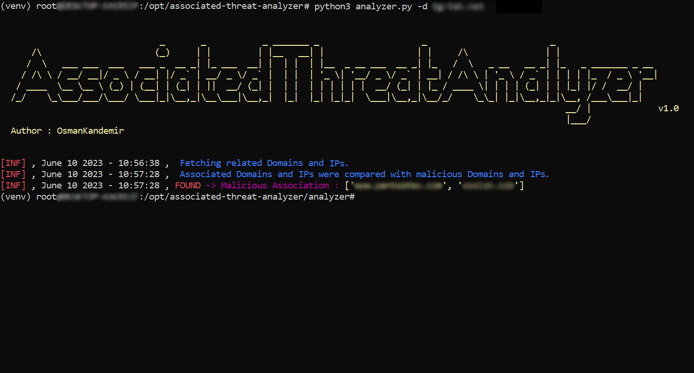

[](https://www.github.com/OsmanKandemir/associated-threat-analyzer)
[](https://github.com/OsmanKandemir/associated-threat-analyzer)
[](https://github.com/OsmanKandemir/static-threat-analyzer/blob/main/LICENSE)
[](https://www.python.org)
[](https://www.docker.com)


# Associated-Threat-Analyzer

#### NOTE : What do privacy laws say about sharing malicious domains and IPs ? Please See; [USAGE_POLICY.md](USAGE_POLICY.md) [LICENSE](LICENSE)

## Description

Associated-Threat-Analyzer detects malicious IPv4 addresses and domain names associated with your web application using local malicious domain and IPv4 lists.

## ScreenShot



## Installation

### From Git

```
git clone https://github.com/OsmanKandemir/associated-threat-analyzer.git
cd associated-threat-analyzer && pip3 install -r requirements.txt
python3 analyzer.py -d target-web.com
```

### From Dockerfile

You can run this application on a container after build a Dockerfile.

###### Warning : If you want to run a Docker container, associated threat analyzer recommends to use your malicious IPs and domains lists, because maintainer may not be update a default malicious IP and domain lists on docker image.

```
docker build -t osmankandemir/threatanalyzer .
docker run osmankandemir/threatanalyzer -d target-web.com
```

### From DockerHub

```
docker pull osmankandemir/threatanalyzer
docker run osmankandemir/threatanalyzer -d target-web.com
```
## Usage

```
-d DOMAIN , --domain DOMAIN Input Target. --domain target-web1.com
-t DOMAINSFILE, --DomainsFile Malicious Domains List to Compare. -t SampleMaliciousDomains.txt
-i IPSFILE, --IPsFile Malicious IPs List to Compare. -i SampleMaliciousIPs.txt
-o JSON, --json JSON  JSON output. --json
```

## DONE

- [x] First-level depth scan your domain address.


## TODO list

- [ ] Third-level or the more depth static files scanning for target web application.

##### Other linked github project. You can take a look.

###### Finds related domains and IPv4 addresses to do threat intelligence after Indicator-Intelligence v1.1.1 collects static files

https://github.com/OsmanKandemir/indicator-intelligence

## Default Malicious IPs and Domains Sources

https://github.com/stamparm/blackbook

https://github.com/stamparm/ipsum

## Development and Contribution

#### See; [CONTRIBUTING.md](CONTRIBUTING.md)


## License

Copyright (c) 2023 Osman Kandemir \
Licensed under the GPL-3.0 License.

## Donations

If you like Indicator-Intelligence and would like to show support, you can use **Buy A Coffee** or **Github Sponsors** feature for the developer using the button below.

Or

Sponsor me : https://github.com/sponsors/OsmanKandemir 😊

<a href="https://www.buymeacoffee.com/OsmanKandemir" target="_blank"></a>

Your support will be much appreciated😊